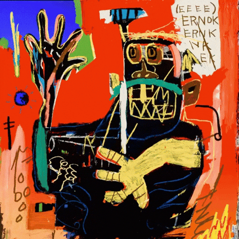

<p align="center">
  <!-- Typing sits above -->
  
</p>

<!-- 👁️ Visitor Counter -->
<p align="center">
  
</p>

[](https://github.com/yuanpngn)

### ⏱️ Weekly Development Breakdown

<!--START_SECTION:waka-->


**🐱 My GitHub Data** 

> 📦 1.3 MB Used in GitHub's Storage 
 > 
> 🏆 210 Contributions in the Year 2025
 > 
> 🚫 Not Opted to Hire
 > 
> 📜 15 Public Repositories 
 > 
> 🔑 38 Private Repositories 
 > 
**I'm a Night 🦉** 

```text
🌞 Morning                167 commits         ███░░░░░░░░░░░░░░░░░░░░░░   12.43 % 
🌆 Daytime                195 commits         ████░░░░░░░░░░░░░░░░░░░░░   14.51 % 
🌃 Evening                550 commits         ██████████░░░░░░░░░░░░░░░   40.92 % 
🌙 Night                  432 commits         ████████░░░░░░░░░░░░░░░░░   32.14 % 
```
📅 **I'm Most Productive on Monday** 

```text
Monday                   310 commits         ██████░░░░░░░░░░░░░░░░░░░   23.07 % 
Tuesday                  240 commits         ████░░░░░░░░░░░░░░░░░░░░░   17.86 % 
Wednesday                188 commits         ███░░░░░░░░░░░░░░░░░░░░░░   13.99 % 
Thursday                 147 commits         ███░░░░░░░░░░░░░░░░░░░░░░   10.94 % 
Friday                   174 commits         ███░░░░░░░░░░░░░░░░░░░░░░   12.95 % 
Saturday                 84 commits          ██░░░░░░░░░░░░░░░░░░░░░░░   06.25 % 
Sunday                   201 commits         ████░░░░░░░░░░░░░░░░░░░░░   14.96 % 
```


📊 **This Week I Spent My Time On** 

```text
🕑︎ Time Zone: Asia/Manila

💬 Programming Languages: 
Python                   5 hrs 7 mins        ███████████░░░░░░░░░░░░░░   42.35 % 
Other                    4 hrs 10 mins       █████████░░░░░░░░░░░░░░░░   34.53 % 
C++                      1 hr 21 mins        ███░░░░░░░░░░░░░░░░░░░░░░   11.22 % 
Text                     23 mins             █░░░░░░░░░░░░░░░░░░░░░░░░   03.28 % 
SQL                      21 mins             █░░░░░░░░░░░░░░░░░░░░░░░░   02.93 % 

🔥 Editors: 
VS Code                  8 hrs 16 mins       █████████████████░░░░░░░░   68.32 % 
GitHubDesktop            1 hr 52 mins        ████░░░░░░░░░░░░░░░░░░░░░   15.53 % 
Zoom                     1 hr 41 mins        ███░░░░░░░░░░░░░░░░░░░░░░   13.94 % 
Notion                   11 mins             ░░░░░░░░░░░░░░░░░░░░░░░░░   01.55 % 
Xcode                    4 mins              ░░░░░░░░░░░░░░░░░░░░░░░░░   00.65 % 

🐱‍💻 Projects: 
cf_routine               7 hrs 24 mins       ███████████████░░░░░░░░░░   61.22 % 
olap-warehouse           1 hr 46 mins        ████░░░░░░░░░░░░░░░░░░░░░   14.62 % 
threading_primes_variants1 hr 40 mins        ███░░░░░░░░░░░░░░░░░░░░░░   13.78 % 
Final                    53 mins             ██░░░░░░░░░░░░░░░░░░░░░░░   07.30 % 
STDISCM-PS1              18 mins             █░░░░░░░░░░░░░░░░░░░░░░░░   02.55 % 

💻 Operating System: 
Mac                      12 hrs 6 mins       █████████████████████████   100.00 % 
```

**I Mostly Code in JavaScript** 

```text
JavaScript               10 repos            ██████░░░░░░░░░░░░░░░░░░░   22.73 % 
C++                      7 repos             ████░░░░░░░░░░░░░░░░░░░░░   15.91 % 
Python                   7 repos             ████░░░░░░░░░░░░░░░░░░░░░   15.91 % 
C#                       2 repos             █░░░░░░░░░░░░░░░░░░░░░░░░   04.55 % 
TypeScript               1 repo              █░░░░░░░░░░░░░░░░░░░░░░░░   02.27 % 
```


**Timeline**


 Last Updated on 29/10/2025 18:50:26 UTC
<!--END_SECTION:waka-->


<!-- 🎨 Animated Art Gifs -->
<p align="center">
  
  
</p>

<!-- 🏆 GitHub Trophies -->
<!--<p align="center">
  
</p>

<h3 align="left">Connect with me:</h3>
<p align="left">
<a href="https://linkedin.com/in/yuan-pangan" target="blank"></a>
<a href="https://instagram.com/yuanpngn" target="blank"></a>
<a href="https://medium.com/yuanpngn" target="blank"></a>
<a href="https://discord.gg/omsm" target="blank"></a>
</p>

<h3 align="left">Languages and Tools:</h3>
<p align="left"> <a href="https://developer.android.com" target="_blank" rel="noreferrer">  </a> <a href="https://angular.io" target="_blank" rel="noreferrer">  </a> <a href="https://angular.io" target="_blank" rel="noreferrer">  </a> <a href="https://www.arduino.cc/" target="_blank" rel="noreferrer">  </a> <a href="https://aws.amazon.com" target="_blank" rel="noreferrer">  </a> <a href="https://www.blender.org/" target="_blank" rel="noreferrer">  </a> <a href="https://getbootstrap.com" target="_blank" rel="noreferrer">  </a> <a href="https://www.cprogramming.com/" target="_blank" rel="noreferrer">  </a> <a href="https://www.chartjs.org" target="_blank" rel="noreferrer">  </a> <a href="https://www.w3schools.com/cpp/" target="_blank" rel="noreferrer">  </a> <a href="https://www.w3schools.com/cs/" target="_blank" rel="noreferrer">  </a> <a href="https://www.w3schools.com/css/" target="_blank" rel="noreferrer">  </a> <a href="https://www.cypress.io" target="_blank" rel="noreferrer">  </a> <a href="https://www.docker.com/" target="_blank" rel="noreferrer">  </a> <a href="https://expressjs.com" target="_blank" rel="noreferrer">  </a> <a href="https://www.figma.com/" target="_blank" rel="noreferrer">  </a> <a href="https://cloud.google.com" target="_blank" rel="noreferrer">  </a> <a href="https://git-scm.com/" target="_blank" rel="noreferrer">  </a> <a href="https://www.w3.org/html/" target="_blank" rel="noreferrer">  </a> <a href="https://www.adobe.com/in/products/illustrator.html" target="_blank" rel="noreferrer">  </a> <a href="https://www.java.com" target="_blank" rel="noreferrer">  </a> <a href="https://developer.mozilla.org/en-US/docs/Web/JavaScript" target="_blank" rel="noreferrer">  </a> <a href="https://kotlinlang.org" target="_blank" rel="noreferrer">  </a> <a href="https://www.mongodb.com/" target="_blank" rel="noreferrer">  </a> <a href="https://www.microsoft.com/en-us/sql-server" target="_blank" rel="noreferrer">  </a> <a href="https://www.mysql.com/" target="_blank" rel="noreferrer">  </a> <a href="https://nodejs.org" target="_blank" rel="noreferrer">  </a> <a href="https://www.oracle.com/" target="_blank" rel="noreferrer">  </a> <a href="https://www.photoshop.com/en" target="_blank" rel="noreferrer">  </a> <a href="https://www.php.net" target="_blank" rel="noreferrer">  </a> <a href="https://www.python.org" target="_blank" rel="noreferrer">  </a> <a href="https://reactjs.org/" target="_blank" rel="noreferrer">  </a> <a href="https://reactnative.dev/" target="_blank" rel="noreferrer">  </a> <a href="https://scikit-learn.org/" target="_blank" rel="noreferrer">  </a> <a href="https://www.selenium.dev" target="_blank" rel="noreferrer">  </a> <a href="https://spring.io/" target="_blank" rel="noreferrer">  </a> <a href="https://www.typescriptlang.org/" target="_blank" rel="noreferrer">  </a> <a href="https://unity.com/" target="_blank" rel="noreferrer">  </a> <a href="https://vuejs.org/" target="_blank" rel="noreferrer">  </a> </p>-->

<!-- 📊 GitHub Stats -->
<p align="center">
  
  
</p>

<h3 align="left">Connect with me:</h3>

<p align="left">
<a href="https://linkedin.com/in/yuan-pangan" target="blank"></a>
<a href="https://instagram.com/yuanpngn" target="blank"></a>
<a href="https://discord.gg/omsm" target="blank"></a>
<a href="https://medium.com/@yuanpngn" target="blank"></a>
</p>

Last Updated on 27/06/2025 08:31:43 UTC

